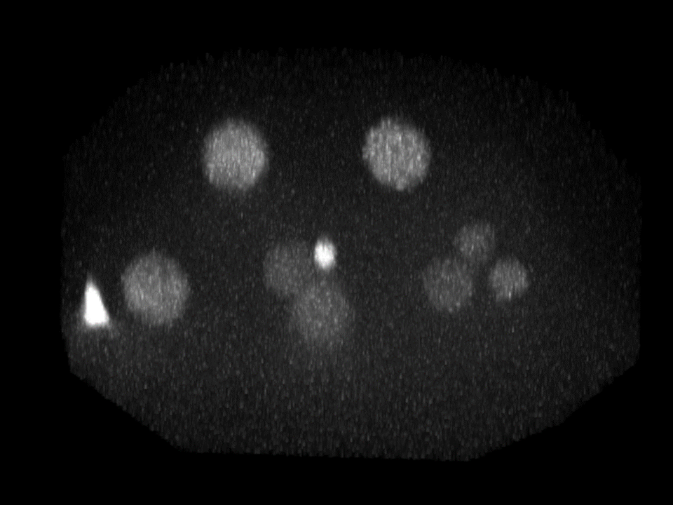
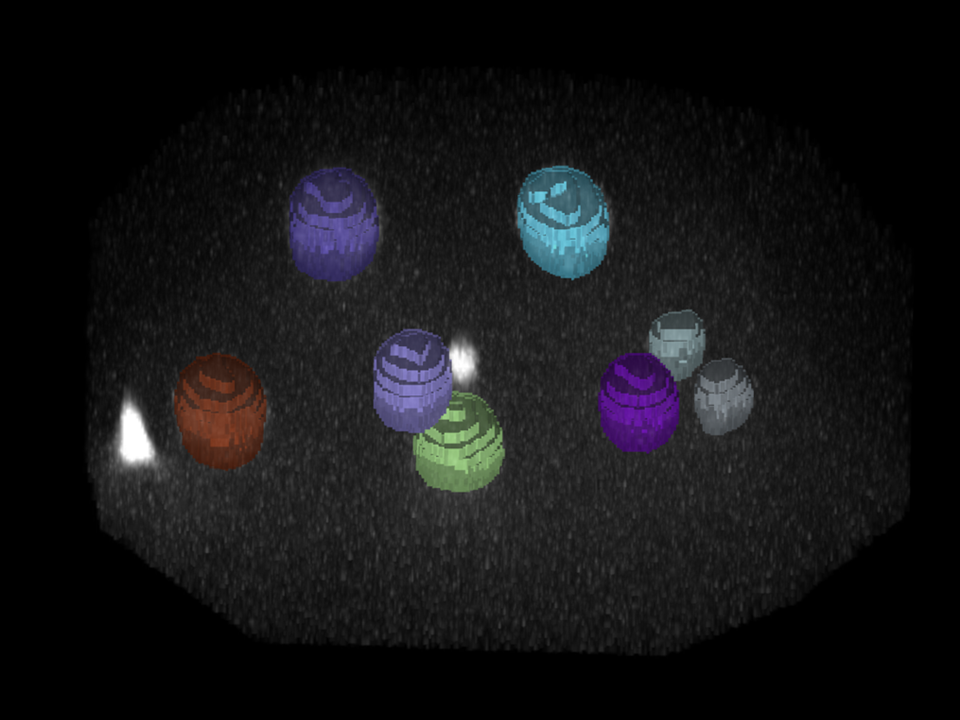
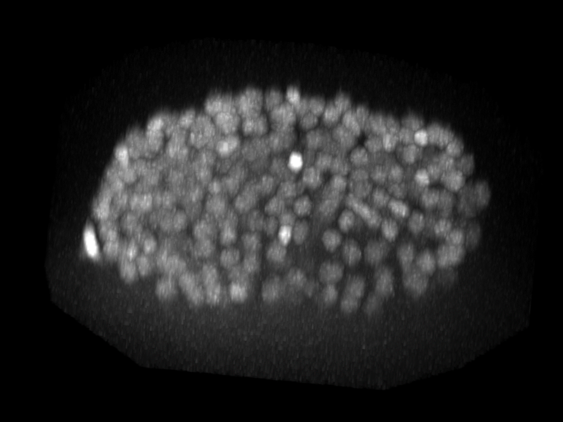
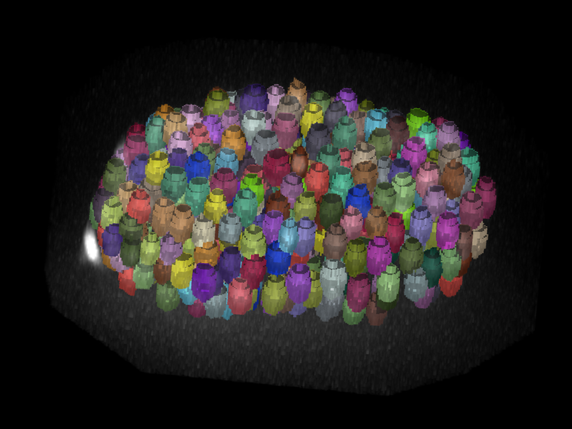

# PyTorch StarDist
This repository contains PyTorch implementations for StarDist 3D as described in:

- Martin Weigert, Uwe Schmidt, Robert Haase, Ko Sugawara, and Gene Myers.  
[*Star-convex Polyhedra for 3D Object Detection and Segmentation in Microscopy*](http://openaccess.thecvf.com/content_WACV_2020/papers/Weigert_Star-convex_Polyhedra_for_3D_Object_Detection_and_Segmentation_in_Microscopy_WACV_2020_paper.pdf). The IEEE Winter Conference on Applications of Computer Vision (WACV), Snowmass Village, Colorado, March 2020

- and based on the PyTorch implementation by [*hthierno*] https://github.com/hthierno/pytorch-stardist

## Examples

| Input images | StarDist3D predictions |
| ------- | ------- |
|  |  |

|  |  |

## Installation

You should have a C++ compiler installed as this code relies on C/C++ extensions that need to be compiled. You may follow these steps to install Stardist 3D:

1. Download the repo

2. Create a python 3.7.9 conda environment with cuda toolkit for GPU-based computing:
> conda create --name <environment name> python=3.7.9 cudatoolkit

3. Activate the conda environmnet:
> conda activate <environment name>

4. Navigate to the directory containing the requirements.txt file and install the dependencies:
> pip install -r ./requirements.txt

5. Install the package by running from the same directory:
> pip install .

## Run from the command line

Training:
> trainStardist3D --config ./configs/train_Stadist3D_v001.yml

Prediction:

Evaluation:

## Run from Jupyter Notebook
