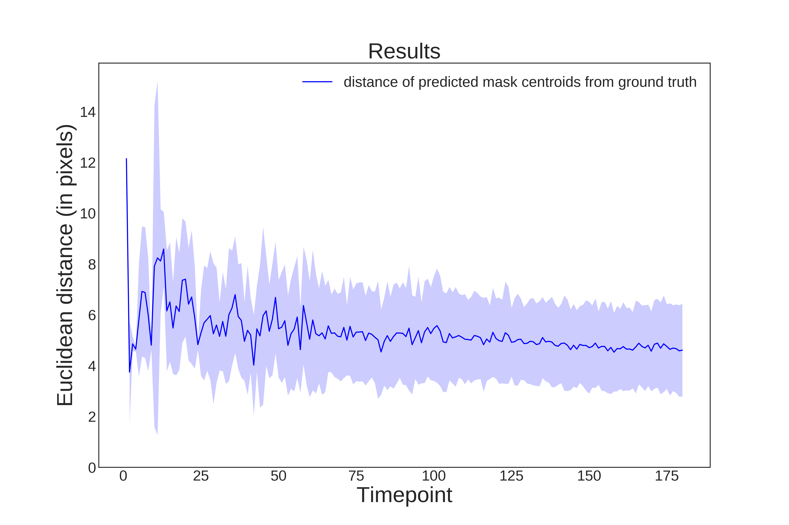

# StarDist3D
This repository contains a user-friendly PyTorch implementation of StarDist 3D for nuclei segmentation based on:

- Martin Weigert, Uwe Schmidt, Robert Haase, Ko Sugawara, and Gene Myers.  
[*Star-convex Polyhedra for 3D Object Detection and Segmentation in Microscopy*](http://openaccess.thecvf.com/content_WACV_2020/papers/Weigert_Star-convex_Polyhedra_for_3D_Object_Detection_and_Segmentation_in_Microscopy_WACV_2020_paper.pdf). The IEEE Winter Conference on Applications of Computer Vision (WACV), Snowmass Village, Colorado, March 2020

- and Stardist PyTorch implementation by [*hthierno*] https://github.com/hthierno/pytorch-stardist

## Examples (from <em> C. elegans </em> embryos)

| Input images | StarDist3D predictions |
| ------- | ------- |
|  |  |
|  |  |

## Installation

You should have a C++ compiler installed as this code relies on C/C++ extensions that need to be compiled. You may follow these steps to install Stardist 3D:

1. Download the repo
> git clone https://github.com/itarampoulous/StarDist3D

2. Create a python 3.7.9 conda environment with cuda toolkit for GPU-based computing:
> conda create --name <environment name> python=3.7.9 cudatoolkit

3. Activate the conda environment:
> conda activate <environment name>

4. Navigate to the directory (StarDist3D) containing the requirements.txt file and install the dependencies:
> pip install -r ./requirements.txt

5. Install the package by running from the same directory:
> pip install .

## Run from the command line

##### Training using a training configuration file (see examples):
> trainStardist3D --config path/to/training_configuration.yml

##### Prediction using a prediction configuration file (see examples):
> predictStardist3D --config path/to/prediction_configuration.yml

##### Evaluation using an evaluation configuration file (see examples):
> evaluateStardist3D --config path/to/evaluation_configuration.yml

###### Example of evaluation metrics on <em> C. elegans </em> embryo

| Evaluation on ground truth nuclei centroids | Evaluation on ground truth masks |
| ------- | ------- |
|  |  |
|  |  |

## Run from Jupyter Notebook
